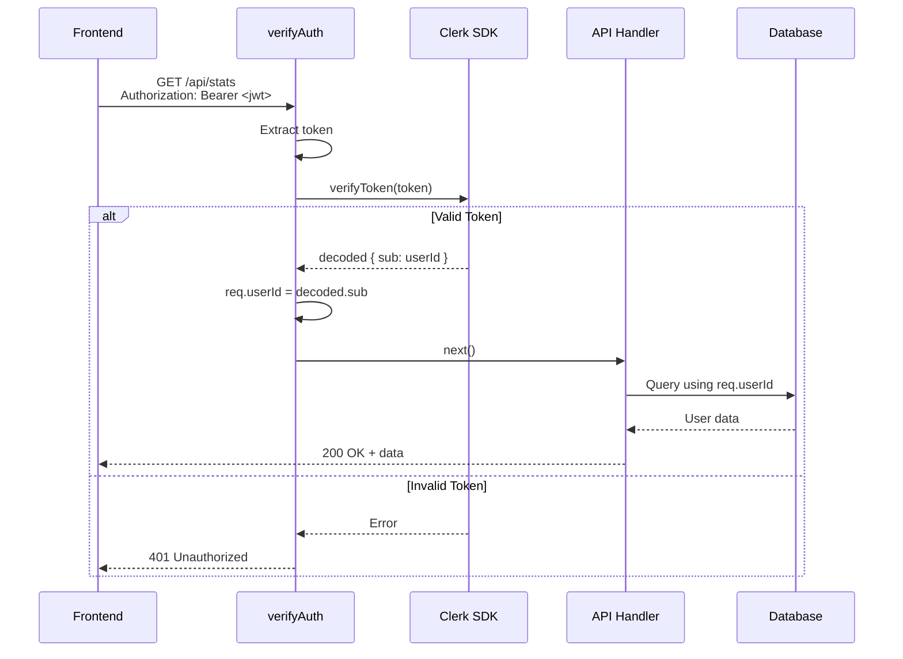

# JWT Verification Implementation - COMPLETE ✅

**Status:** Fully Implemented and Working
**Date:** January 2026
**Security Level:** Production Ready

---

## Overview

Certverse backend has **full JWT verification** implemented using Clerk SDK. All protected endpoints require valid JWT tokens in the `Authorization: Bearer <token>` header.

---

## Implementation Details

### 1. Middleware: `verifyAuth`

**Location:** `backend/src/middleware/verifyAuth.ts`

**Functionality:**
- Extracts JWT token from `Authorization: Bearer <token>` header
- Verifies token using Clerk SDK's `verifyToken()` method
- Extracts `userId` from verified token (from `decoded.sub`)
- Attaches `userId` to `req.userId` for downstream handlers
- Returns 401 Unauthorized for invalid/missing/expired tokens

**Error Handling:**
- ✅ Missing Authorization header → 401 with message
- ✅ Invalid token format → 401 with message
- ✅ Expired token → 401 with specific "Token has expired" message
- ✅ Malformed token → 401 with specific message
- ✅ Generic verification errors → 401 with message

### 2. Clerk Client Setup

**Location:** `backend/src/lib/clerk.ts`

**Configuration:**
- Uses `@clerk/clerk-sdk-node` v5.1.6
- Requires `CLERK_SECRET_KEY` environment variable
- Creates singleton Clerk client instance
- Logs initialization status

**Environment Variable Required:**
```bash
CLERK_SECRET_KEY=sk_live_xxxxx  # or sk_test_xxxxx for development
```

### 3. Protected Endpoints

All the following endpoints are protected with `verifyAuth` middleware:

**Subscription Management:**
- `GET /api/subscription` - Get user subscription
- `POST /api/checkout/create` - Create checkout session
- `GET /api/subscription/portal-url` - Get customer portal URL

**Question Practice:**
- `GET /api/question` - Get random question
- `POST /api/submit-answer` - Submit answer
- `POST /api/submit` - Submit answer (alias)
- `GET /api/unlock/remaining` - Check daily limit

**User Stats:**
- `GET /api/stats` - Get basic stats
- `GET /api/stats/enhanced` - Get enhanced stats with domain performance
- `GET /api/history` - Get response history

**Onboarding:**
- `GET /api/onboarding/status` - Get onboarding status
- `POST /api/onboarding/start` - Start onboarding
- `POST /api/onboarding/goal` - Save goal
- `POST /api/onboarding/confidence` - Save confidence ratings
- `GET /api/onboarding/weak-topics` - Get weak topics
- `GET /api/onboarding/recommended-difficulty` - Get recommended difficulty
- `POST /api/onboarding/step` - Update onboarding step
- `POST /api/onboarding/complete` - Complete onboarding
- `GET /api/onboarding/preferences` - Get preferences
- `PUT /api/onboarding/preferences` - Update preferences
- `POST /api/onboarding/tip/shown` - Mark tip as shown
- `GET /api/onboarding/tip/check` - Check if tip shown

### 4. Public Endpoints (No Auth Required)

These endpoints are intentionally public:
- `GET /health` - Health check
- `GET /api/question-count` - Total question count
- `POST /api/webhooks/polar` - Polar.sh webhook (signature verified)

---

## How It Works

### Request Flow



### Code Example

```typescript
// In API handler (e.g., get-question.ts)
export async function getQuestion(req: Request, res: Response): Promise<void> {
  // userId is extracted from verified JWT by verifyAuth middleware
  const userId = (req as any).userId; // ✅ SAFE - verified by Clerk
  
  // Use userId securely
  const remaining = await getRemainingQuestions(userId);
  // ...
}
```

### Frontend Integration

Frontend must send JWT token in every protected API request:

```typescript
// Example: frontend/lib/api.ts
const response = await fetch(`${API_URL}/api/stats`, {
  headers: {
    'Authorization': `Bearer ${await getToken()}`, // Clerk provides getToken()
    'Content-Type': 'application/json',
  },
});
```

---

## Security Benefits

✅ **No userId Spoofing:** Backend doesn't trust client-provided userId
✅ **Token Expiration:** Expired tokens are rejected
✅ **Signature Verification:** Tokens are cryptographically verified
✅ **Centralized Auth:** All protected endpoints use same middleware
✅ **Type Safety:** TypeScript extension for `req.userId`
✅ **Clear Error Messages:** Specific error messages for debugging

---

## Testing

### Manual Test with cURL

```bash
# Test without token (should fail)
curl -X GET https://certverse-production.up.railway.app/api/stats
# Response: 401 Unauthorized

# Test with invalid token (should fail)
curl -X GET https://certverse-production.up.railway.app/api/stats \
  -H "Authorization: Bearer fake_token"
# Response: 401 Unauthorized

# Test with valid token (should succeed)
# Get token from Clerk frontend: await getToken()
curl -X GET https://certverse-production.up.railway.app/api/stats \
  -H "Authorization: Bearer <valid_clerk_jwt>"
# Response: 200 OK + user stats
```

### Automated Test Script

Run the provided test script:

```bash
cd backend
./test-jwt-verification.sh
```

This tests:
- ✅ Request without Authorization header → 401
- ✅ Request with invalid token → 401
- ✅ Request with malformed header → 401
- ✅ Public endpoints work without auth
- ✅ All protected endpoints reject unauthenticated requests

---

## Configuration Checklist

### Development Environment

- [x] `CLERK_SECRET_KEY` set in `backend/.env`
- [x] Clerk SDK installed (`@clerk/clerk-sdk-node`)
- [x] Frontend configured with Clerk publishable key
- [x] CORS allows frontend URL

### Production Environment (Railway)

- [x] `CLERK_SECRET_KEY` environment variable set in Railway
- [x] Frontend sends JWT tokens in Authorization header
- [x] CORS configured for production frontend URL
- [x] Logging enabled for auth failures (Winston)

---

## Troubleshooting

### Issue: "Unauthorized" errors in production

**Causes:**
1. Frontend not sending Authorization header
2. Token expired (Clerk tokens expire after 1 hour by default)
3. Wrong `CLERK_SECRET_KEY` environment variable

**Solutions:**
1. Verify frontend is calling `getToken()` from `@clerk/nextjs`
2. Ensure frontend refreshes expired tokens automatically
3. Check Railway environment variables match Clerk dashboard

### Issue: "CLERK_SECRET_KEY not configured"

**Solution:**
- Add `CLERK_SECRET_KEY` to Railway environment variables
- Restart Railway service after adding

### Issue: 401 errors in logs

**Expected:** Some 401s are normal (expired tokens, testing)
**Action Required:** If 401 rate > 5%, investigate frontend token handling

---

## Additional Security Layers

Beyond JWT verification, Certverse also has:

1. **Input Validation** (Zod schemas) - ✅ Implemented
2. **Rate Limiting** (express-rate-limit) - ✅ Implemented
3. **Security Headers** (Helmet) - ✅ Implemented
4. **RLS Policies** (Supabase) - ⏳ Needs tightening (next task)
5. **Watermarking** (content protection) - ✅ Implemented
6. **Error Sanitization** (no stack traces in prod) - ✅ Implemented

---

## Next Steps

1. ✅ JWT verification - **COMPLETE**
2. ⏳ RLS policy tightening - **In Progress**
3. ⏳ Penetration testing
4. ⏳ Security audit before public launch

---

## References

- Clerk Documentation: https://clerk.com/docs
- Clerk Backend SDK: https://clerk.com/docs/references/backend/overview
- JWT Verification: https://clerk.com/docs/backend-requests/handling/manual-jwt

---

**Last Updated:** January 18, 2026
**Status:** ✅ Production Ready
